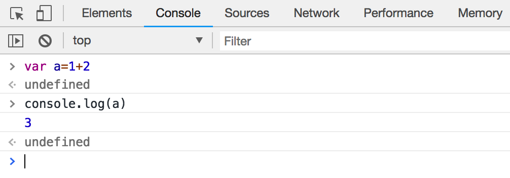

## JavaScript 重点 002 调试、数据类型和变量

详细教程请 [点击这里](https://www.liaoxuefeng.com/wiki/001434446689867b27157e896e74d51a89c25cc8b43bdb3000/001434499190108eec0bdf14e704a09935cd112e501e31a000)

### 1.调试：浏览器右键，「检查」，然后点击「Console」


> 先点击“控制台(Console)“，在这个面板里可以直接输入JavaScript代码，按回车后执行。
> 要查看一个变量的内容，在Console中输入`console.log(a);`，回车后显示的值就是变量的内容。


### 2.Numbber数据类型
```JavaScript
0.456; // 浮点数0.456
1.2345e3; // 科学计数法表示1.2345x1000，等同于1234.5
NaN; // NaN表示Not a Number，当无法计算结果时用NaN表示
Infinity; // Infinity表示无限大，当数值超过了JavaScript的Number所能表示的最大值时，就表示为Infinity
```
<br>

```JavaScript
2 / 0; // Infinity
0 / 0; // NaN
10 % 3; // 1    %为求余数运算
```
### 3.数组
数组是一组按顺序排列的集合，集合的每个值称为元素。JavaScript的数组可以包括任意数据类型。例如：
```JavaScript
[1, 2, 3.14, 'Hello', null, true];
```
<br>
<br> 
数组的元素可以通过索引来访问。请注意，索引的起始值为0：
```JavaScript 
var arr = [1, 2, 3.14, 'Hello', null, true];
arr[0]; // 返回索引为0的元素，即1
arr[5]; // 返回索引为5的元素，即true
arr[6]; // 索引超出了范围，返回undefined
```
### 4.对象
JavaScript的对象是一组由键-值组成的无序集合，例如：
```JavaScript 
var person = {
    name: 'Bob',
    age: 20,
    tags: ['JavaScript', 'web', 'mobile'],
    city: 'Beijing',
    hasCar: true,
    zipcode: null
};
```
其中`name`为键，`Bob`为值。
### 5.变量
```JavaScript 
var a; // 申明了变量a，此时a的值为undefined
var $b = 1; // 申明了变量$b，同时给$b赋值，此时$b的值为1
var s_007 = '007'; // s_007是一个字符串
var Answer = true; // Answer是一个布尔值true
var t = null; // t的值是null
```

